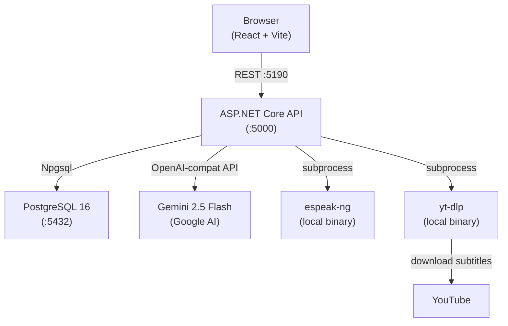
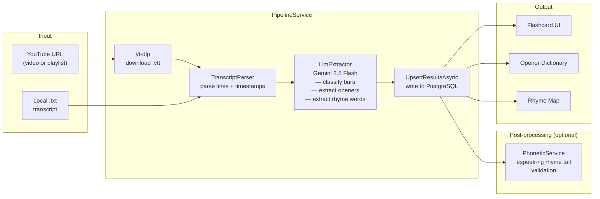
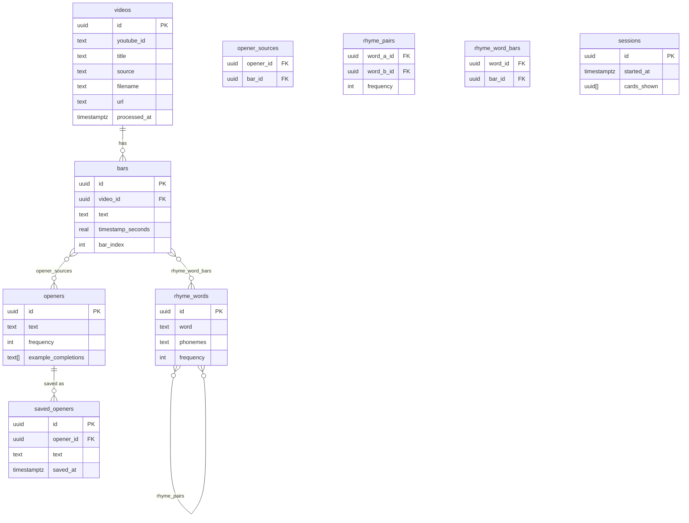

# Harry Mack Freestyle Flashcards

A study tool for freestyle rap technique. Ingests Harry Mack YouTube videos or local transcripts, uses an LLM to extract rap bars, openers, and rhyme patterns, then presents them as interactive flashcards.

---

## Architecture

### System Overview



### Pipeline Data Flow



### Database Schema



---

## Stack

| Layer | Technology |
|---|---|
| Frontend | React 18 + TypeScript + Vite |
| Backend | ASP.NET Core 8 (C#) |
| Database | PostgreSQL 16 |
| LLM | Gemini 2.5 Flash (via OpenAI-compatible API) |
| Phonetics | espeak-ng (X-SAMPA rhyme tail comparison) |
| Subtitles | yt-dlp (VTT auto-subtitles) |
| Container | Docker Compose |

---

## Features

- **Flashcard mode** — drill opener phrases with spaced repetition, save favourites
- **Opener dictionary** — browse all extracted opener templates by frequency
- **Rhyme map** — interactive force-directed graph of phonetically validated rhyme pairs
- **Pipeline** — ingest YouTube videos, playlists, or local `.txt` transcripts
- **Phonetic validation** — post-processing pass using espeak-ng to remove rhyme pairs that don't actually share a vowel+consonant ending

---

## Setup

### Prerequisites

- Docker + Docker Compose
- Gemini API key ([Google AI Studio](https://aistudio.google.com/)) — **paid tier required** for playlist processing (free tier: 20 RPD)

### Run

```bash
cp .env.example .env          # add your GEMINI_API_KEY
docker compose up -d --build
```

| Service | URL |
|---|---|
| Frontend | http://localhost:5190 |
| API | http://localhost:5000 |
| PostgreSQL | localhost:5432 |

### Ingest content

**YouTube video or playlist** — paste URL in the Pipeline page. Playlists process 5 videos concurrently with serialized LLM calls to stay within API rate limits.

**Local transcripts** — drop `.txt` files into `transcripts/` and click *Parse Transcripts*.

**Validate rhymes** — after ingestion, click *Validate Rhymes* to run the espeak-ng phonetic pass and remove false positives.

---

## How the LLM extraction works

Each video's transcript lines are sent to Gemini 2.5 Flash in a single batch. The model returns a JSON array — one object per line — with:

- `is_freestyle` — whether the line is an actual rap bar (vs filler, crowd talk, etc.)
- `opener` — the reusable template portion of the bar before topic-specific content begins
- `rhyme_words` — words that share the **same vowel sound and following consonants** from the last stressed syllable

Rhyme words are then cross-validated with espeak-ng: pairs that don't share an identical X-SAMPA rhyme tail are deleted.
