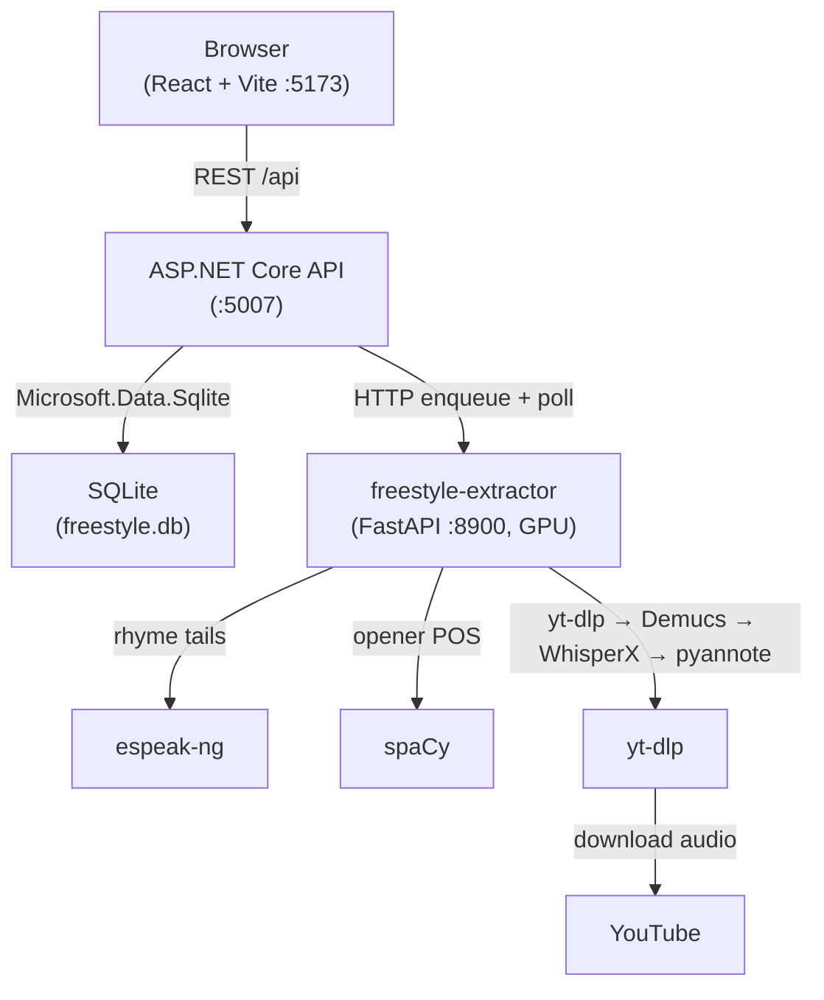
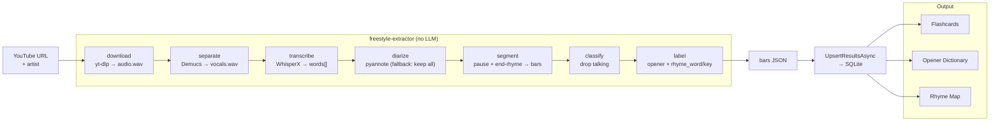
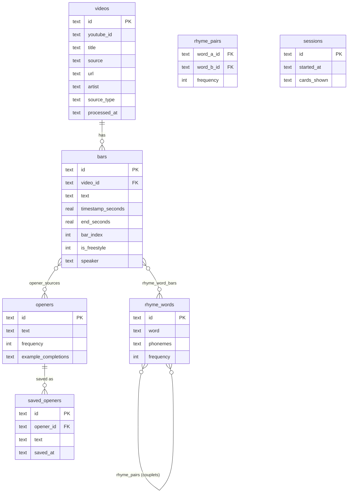

# Harry Mack Freestyle Flashcards

A study tool for freestyle rap technique. Ingests Harry Mack YouTube freestyles, isolates the vocals and transcribes them, then deterministically segments the words into rap **bars** — with openers and rhyme keys — and presents them as interactive flashcards. **No LLM, no paid APIs, no Docker** — everything runs locally.

---

## Architecture

Three native processes on localhost. The React app talks to the .NET API; the API is the sole database writer and delegates all audio work to a Python "extractor" sidecar.

### System Overview



### Pipeline Data Flow



### Database Schema (SQLite)

Ids are C#-generated GUID strings stored as `TEXT`; array columns are JSON text; timestamps are ISO-8601 / `datetime('now')` text.



---

## Stack

| Layer | Technology |
|---|---|
| Frontend | React 19 + TypeScript + Vite |
| Backend | ASP.NET Core 8 (C#) |
| Database | SQLite (`Microsoft.Data.Sqlite`, single `freestyle.db` file) |
| Extractor | Python + FastAPI sidecar — Demucs, WhisperX, pyannote, spaCy |
| Phonetics | espeak-ng (X-SAMPA rhyme-tail comparison) |
| Audio | yt-dlp (audio download) |

---

## Features

- **Flashcard mode** — drill opener phrases, save favourites
- **Opener dictionary** — browse extracted opener templates by frequency
- **Rhyme map** — force-directed graph of phonetically validated rhyme pairs (couplets fall out of shared rhyme keys)
- **Pipeline** — ingest a YouTube freestyle URL (or playlist) for a chosen artist
- **Phonetic validation** — espeak-ng pass that removes rhyme pairs not sharing a vowel+consonant ending

---

## Setup (no Docker)

### Prerequisites

- **Python 3.11** (for the extractor sidecar — Demucs / WhisperX / pyannote)
- **.NET 8 SDK**
- **Node + pnpm**
- **espeak-ng** and **yt-dlp** on `PATH`
- *(optional)* a free [HuggingFace token](https://huggingface.co/settings/tokens) for speaker diarization — without it, the sidecar keeps all speech

### Install

```powershell
./setup.ps1     # creates the sidecar venv, installs deps, restores backend, installs frontend
```

### Run

```powershell
./start.ps1     # launches API :5007, frontend :5173, extractor :8900 in separate windows
```

Then open **http://localhost:5173**, paste a Harry Mack freestyle URL on the Pipeline page, pick the artist, and process. Bars appear in the flashcard / opener / rhyme views. SQLite `freestyle.db` is created automatically on first API run.

> The extractor sidecar is GPU-bound (one job at a time). It is optional for browsing already-extracted data — the API and frontend run without it; only new extraction needs it up.

---

## How extraction works (no LLM)

YouTube auto-captions are a rolling-window format with no bar boundaries or reliable timing, ASR'd over the full mix. Instead of asking an LLM to recover structure that was never in the input, the sidecar builds a real transcript and imposes bar structure deterministically:

1. **yt-dlp** downloads the audio.
2. **Demucs** isolates the vocals (strips the beat).
3. **WhisperX** produces a word-level transcript with timings (`language="en"`).
4. **pyannote** keeps the dominant speaker (graceful fallback: keep all speech).
5. **segment** cuts the word stream into bars using pause gaps + end-rhyme (espeak-ng X-SAMPA tails).
6. **classify** drops crowd/host/between-bars talking.
7. **label** attaches an opener (spaCy POS rule) and `rhyme_word` / `rhyme_key` per bar.

The .NET API upserts the returned bars into SQLite and forms rhyme pairs (couplets) from bars that share a rhyme key.
